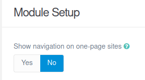

# Tutorials for Editorial Theme

## Default Options

Editorial comes with a few default options that can be set site-wide.  These options are:

```yaml
production-mode:              # In production mode, only minified CSS is used. When disabled, nested CSS are enabled
sidebar_open:                 # Option to display the main page with the sidebar open or closed.
google_fonts_local:           # Option to load Google Fonts from the theme or from Google servers.
menu_langswitcher:            # Enable/Disable langswitcher icon in menu (langswitcher plugin needed)
menu_search:                  # Enable/Disable search icon in menu (simplesearch plugin needed)
menu_login:                   # Enable/Disable login icon in menu
favicon:                      # Choosse your own favicon
custom_logo:                  # A custom logo rather than the default (see below)  
custom_logo_mobile:           # A custom logo to use for mobile navigation
custom_logo_width:            # Set custom width for custom logo
themeSlogan:                  # Custom text for slogan
blog-page: '/blog'            # The route to the blog listing page, useful for a blog style layout
featured:                     # Enable/Disable featured posts in left sidebar
featured_tag:                 # Select category name for featured posts (configured in taxonomies)
featured_number:              # The number of featured posts will be displayed on the left sidebar
contact_section:              # Set copyright text, contact text, contact email and other contact information
social_enabled:               # Enable/Disable social icons in footer
custommenus.enabled:          # Enable/Disable custom menus in top menu
```
To make modifications, you can copy the `user/themes/editorial/editorial.yaml` file to `user/config/themes/` folder and modify, or you can use the admin plugin.

> [!WARNING]
> Do not modify the `user/themes/editorial/editorial.yaml` file directly or your changes will be lost with any updates

## Custom Logos

To add a custom logo, you should put the log into the `user/themes/editorial/images/logo` folder.  Standard image formats are support (`.png`,`.jpg`, `.gif`, `.svg`, etc.).  Then reference the logo via the YAML like so:

```yaml
custom_logo:
    - name: 'my-custom-logo.png'
custom_logo_mobile:
    - name: 'my-custom-mobile-logo.png'    
```
Alternatively, you can you use the drag-n-drop "Custom Logo" field in the Editorial theme options.

## Gallery Options

| Option | Type | Default | Description |
| --- | --- | --- | --- |
| openEffect | string | `zoom` | Name of the effect on lightbox open. (zoom, fade, none) |
| closeEffect | string | `zoom` | Name of the effect on lightbox close. (zoom, fade, none) |
| slideEffect | string | `slide` | Name of the effect on slide change. (slide, fade, zoom, none) |
| moreText | string | `See more` | More text for descriptions on mobile devices. |
| moreLength | number | `60` | Number of characters to display on the description before adding the moreText link (only for mobiles), if 0 it will display the entire description. |
| closeButton | boolean | `true` | Show or hide the close button. |
| touchNavigation | boolean | `true` | Enable or disable the touch navigation (swipe). |
| touchFollowAxis | boolean | `true` | Image follow axis when dragging on mobile. |
| keyboardNavigation | boolean | `true` | Enable or disable the keyboard navigation. |
| closeOnOutsideClick | boolean | `true` | Close the lightbox when clicking outside the active slide. |
| startAt | number | `0` | Start lightbox at defined index. |
| width | number | `900px` | Default width for inline elements and iframes, you can define a specific size on each slide. You can use any unit for example 90% or 100vw for full width |
| height | number | `506px` | Default height for inline elements and iframes, you can define a specific size on each slide.You can use any unit for example 90% or 100vh **For inline elements you can set the height to auto**. |
| descPosition | string | `bottom` | Global position for slides description, you can define a specific position on each slide (bottom, top, left, right). |
| loop | boolean | `false` | Loop slides on end. |
| zoomable | boolean | `true` | Enable or disable zoomable images you can also use data-zoomable="false" on individual nodes. |
| draggable | boolean | `true` | Enable or disable mouse drag to go prev and next slide (only images and inline content), you can also use data-draggable="false" on individual nodes. |
| dragToleranceX | number | `40` | Used with draggable. Number of pixels the user has to drag to go to prev or next slide. |
| dragToleranceY | number | `65` | Used with draggable. Number of pixels the user has to drag up or down to close the lightbox (Set 0 to disable vertical drag). |
| dragAutoSnap | boolean | `false` | If true the slide will automatically change to prev/next or close if dragToleranceX or dragToleranceY is reached, otherwise it will wait till the mouse is released. |
| preload | boolean | `true` | Enable or disable preloading. | 

## Shortcodes

### Table Shortcode

#### Usage <!-- {docsify-ignore} -->

It's quite simple. Just wrap a markdown table in `[ed-table]` tags.  The `[ed-table]` shortcode has some optional parameters:

* `class` - alt (this class is provided by Editorial theme)
* `header` - true-<thead> is displayed. 
    
An example of the Table shortcode is as follows:
    

```markdown
[ed-table header=true class="alt"]
| Header 1 | Header 2 |  Header 3 |  Header 4 |
| Cell 1   | Cell 2   | Cell 3   | Cell 4  |
| Cell 5   | Cell 6   | Cell 7   | Cell 8  |
[/ed-table]
```


#### Example <!-- {docsify-ignore} -->
    
[http://editorial.juanvillen.es/shortcodes](http://editorial.juanvillen.es/shortcodes)

### Box Shortcode

#### Usage <!-- {docsify-ignore} -->

Wrap some content block in `[ed-box]` tags.  The `[ed-box]` shortcode has some optional parameters:
    
* `heading` - The heading for box
* `color` - `primary`, `secondary`, `success`, `warning` and `info`. 
* `class` - `alt` (this class remove border from box). 

An example of the Box shortcode is as follows:
    

```markdown
[ed-box color="primary" heading="Primary Box Shortcode"]
Lorem ipsum dolor sit amet, consectetur adipiscing elit. Etiam sed eleifend magna, non tempor urna. 
[/ed-box]
[ed-box color="secondary" heading="Secondary Box Shortcode"]
Lorem ipsum dolor sit amet, consectetur adipiscing elit. Etiam sed eleifend magna, non tempor urna. 
[/ed-box]
[ed-box color="success" heading="Success Box Shortcode"]
Lorem ipsum dolor sit amet, consectetur adipiscing elit. Etiam sed eleifend magna, non tempor urna. 
[/ed-box]
[ed-box color="info" heading="Info Box Shortcode"]
Lorem ipsum dolor sit amet, consectetur adipiscing elit. Etiam sed eleifend magna, non tempor urna. 
[/ed-box]
[ed-box color="warning" heading="Warning Box Shortcode"]
Lorem ipsum dolor sit amet, consectetur adipiscing elit. Etiam sed eleifend magna, non tempor urna. 
[/ed-box]
[ed-box color="danger" heading="Danger Box Shortcode"]
Lorem ipsum dolor sit amet, consectetur adipiscing elit. Etiam sed eleifend magna, non tempor urna. 
[/ed-box]
```


#### Example <!-- {docsify-ignore} -->
    
[http://editorial.juanvillen.es/shortcodes](http://editorial.juanvillen.es/shortcodes)

### Buttons Shortcode
    
#### Usage <!-- {docsify-ignore} -->

Wrap some buttons in `[ed-buttons]` tags.  The `[ed-buttons]` has the following parameters:  `stacked`, `special` or`fit`
    
The `[ed-button]` shortcode that defines each _button_ has the following parameters:
    
* `class`- custom classes for button
* `type` - `primary`, `secondary`, `success`, `info`, `warning` or `danger`. 
* `size` - `small`, `medium`or `large`
* `url`- The button url
* `target`- The target of url

An example of the Buttons shortcode is as follows:


```markdown
[ed-buttons]
    [ed-button type="primary"  url="#"]Primary[/ed-button]
    [ed-button type="secondary" url="#"]Secondary[/ed-button]
    [ed-button type="success" url="#"]Success[/ed-button]
    [ed-button type="info" url="#"]Info[/ed-button]
    [ed-button type="warning" url="#"]Warning[/ed-button]
    [ed-button type="danger" url="#"]Danger[/ed-button]
[/ed-buttons]
[ed-buttons]
    [ed-button type="primary" size="small"  url="#"]Primary[/ed-button]
    [ed-button type="secondary" size="small"   url="#"]Secondary[/ed-button]
    [ed-button type="success" size="small"   url="#"]Success[/ed-button]
    [ed-button type="info" size="small" url="#"]Info[/ed-button]
    [ed-button type="warning" size="small" url="#"]Warning[/ed-button]
    [ed-button type="danger" size="small" url="#"]Danger[/ed-button]
[/ed-buttons]
[ed-buttons ulclass="special"]
    [ed-button type="primary" size="small"  url="#"]Primary[/ed-button]
    [ed-button type="secondary" size="small"   url="#"]Secondary[/ed-button]
[/ed-buttons]
[ed-buttons ulclass="stacked"]
    [ed-button type="primary" size="small"  url="#"]Primary[/ed-button]
    [ed-button type="secondary" size="small"   url="#"]Secondary[/ed-button]
[/ed-buttons]
[ed-buttons ulclass="fit"]
    [ed-button type="primary" size="small"  url="#"]Primary[/ed-button]
    [ed-button type="secondary" size="small"   url="#"]Secondary[/ed-button]
[/ed-buttons]
```


#### Example <!-- {docsify-ignore} -->
    
[http://editorial.juanvillen.es/shortcodes](http://editorial.juanvillen.es/shortcodes)

### Flex row Shortcode
    
#### Usage <!-- {docsify-ignore} -->

Use the `[ed-flex-row]` shortcode to set the number of columns that best render your content and layout. The `[ed-flex-row]` has the following parameters: 
    * `class`- Row classes from Editorial theme (space separated): `gtr-uniform`, `gtr-0`, `gtr-25`, `gtr-50`, `gtr-150`, `gtr-200`, `aln-between`, `aln-around`, `aln-evenly`, `aln-left`, `aln-center`, `aln-right`, `aln-top`, `aln-bottom` and `aln-middle` . 
    
The `[column]` shortcode that defines each to the individual columns (e.g., .col-4 col-12-medium),  has the following parameters:
    
* `class`- Column classes  from Editorial theme (space separated), indicate the number of columns you’d like to use out of the possible 12 per row. So, if you want three equal-width columns across, you can use col-4. To make the grid responsive, there are five grid breakpoints, one for each responsive breakpoint : `xsmall`, `small`, `medium`, `large` and `xlarge`.

An example of the Flex row shortcode is as follows:
    

```markdown
[ed-flex-row class="gtr-50"]
[column class="col-4 col-12-medium"]
[ed-box color="primary" heading="Primary"]
Lorem ipsum dolor sit amet, consectetur adipiscing elit. Etiam sed eleifend magna, non tempor urna. Integer maximus, velit non scelerisque ornare, ante libero porta lorem, ac eleifend felis sapien eu leo. Fusce mauris justo, ullamcorper ut urna a, scelerisque viverra magna.
[/ed-box]
[/column]
    
[column class="col-4 col-12-medium"]
[ed-box color="secondary" heading="Secondary"]
Lorem ipsum dolor sit amet, consectetur adipiscing elit. Etiam sed eleifend magna, non tempor urna. Integer maximus, velit non scelerisque ornare, ante libero porta lorem, ac eleifend felis sapien eu leo. Fusce mauris justo, ullamcorper ut urna a, scelerisque viverra magna.
[/ed-box]
[/column]
    
[column class="col-4 col-12-medium"]
[ed-box color="success" heading="Success"]
Lorem ipsum dolor sit amet, consectetur adipiscing elit. Etiam sed eleifend magna, non tempor urna. Integer maximus, velit non scelerisque ornare, ante libero porta lorem, ac eleifend felis sapien eu leo. Fusce mauris justo, ullamcorper ut urna a, scelerisque viverra magna.
[/ed-box]
[/column]
    
[column class="col-4 col-12-medium"]
[ed-buttons]
    [ed-button type="primary"  url="#"]Primary[/ed-button]
    [ed-button type="secondary" url="#"]Secondary[/ed-button]
    [ed-button type="success" url="#"]Success[/ed-button]
    [ed-button type="info" url="#"]Info[/ed-button]
    [ed-button type="warning" url="#"]Warning[/ed-button]
    [ed-button type="danger" url="#"]Danger[/ed-button]
[/ed-buttons]
[/column]
    
[column class="col-4 col-12-medium"]
[ed-table header=true class="alt"]
| Header 1 | Header 2 |  Header 3 |  Header 4 |
| Cell 1   | Cell 2   | Cell 3   | Cell 4  |
| Cell 5   | Cell 6   | Cell 7   | Cell 8  |
[/ed-table]
[/column]
    
[column class="col-4 col-12-medium"]
> Blockquote text
 
Lorem ipsum dolor sit amet, consectetur adipiscing elit. Etiam sed eleifend magna, non tempor urna. Integer maximus, velit non scelerisque ornare, ante libero porta lorem, ac eleifend felis sapien eu leo.
[/column]
    
[/ed-flex-row]
```


#### Example <!-- {docsify-ignore} -->
    
[http://editorial.juanvillen.es/shortcodes](http://editorial.juanvillen.es/shortcodes)

### Float image Shortcode

#### Usage <!-- {docsify-ignore} -->

Use the `[ed-float]` shortcode to display a floating image, to the left or right of a text.
    
The `[ed-float]` shortcode has the following parameters:
    
	* `direction` - left or right
    * `image` - Image name from page media
    * `alt` - Alt tag for image
    * `title` - Image title

An example of the Float image shortcode is as follows:
    

```markdown
[ed-float direction=left image="home.jpg" alt="Home" title="Home"]
Lorem ipsum dolor sit amet, consectetur adipiscing elit. Etiam sed eleifend magna, non tempor urna. Integer maximus, velit non scelerisque ornare, ante libero porta lorem, ac eleifend felis sapien eu leo. Fusce mauris justo, ullamcorper ut urna a, scelerisque viverra magna. Pellentesque eu lectus dignissim justo consectetur tristique.
[/ed-float]
[ed-float direction=right image="home.jpg" alt="Home" title="Home"]
Lorem ipsum dolor sit amet, consectetur adipiscing elit. Etiam sed eleifend magna, non tempor urna. Integer maximus, velit non scelerisque ornare, ante libero porta lorem, ac eleifend felis sapien eu leo. Fusce mauris justo, ullamcorper ut urna a, scelerisque viverra magna. Pellentesque eu lectus dignissim justo consectetur tristique.
[/ed-float]
```


#### Example <!-- {docsify-ignore} -->

[http://editorial.juanvillen.es/shortcodes](http://editorial.juanvillen.es/shortcodes)

## Contact Form

### How to build the contact form included in Editorial Theme <!-- {docsify-ignore} -->

First of all, it is important to know how forms work in Grav, so reading the following articles is essential:

> [!INFO|style:callout|label: FORMS]
> [https://learn.getgrav.org/17/forms/forms](https://learn.getgrav.org/17/forms/forms)

> [!INFO|style:callout|label: EXAMPLE FORM]
> [https://learn.getgrav.org/17/forms/forms/example-form](https://learn.getgrav.org/17/forms/forms/example-form)

> [!INFO|style:callout|label: FORMS IN MODULAR PAGES]
> [https://learn.getgrav.org/17/forms/forms/how-to-forms-in-modular-pages](https://learn.getgrav.org/17/forms/forms/how-to-forms-in-modular-pages)

First we create the contact page that we will call Contact, and in the Advanced tab we choose contact as the page template.
Afterwards, we select the Expert view mode and after title: Contact, we will insert the following lines that I will explain below (Please note the correct indentation when writing this code.): 

```yaml
cache_enable: false
form:
    name: contact-form
    template: form-messages
    action: /
    classes: 'row gtr-50 gtr-uniform'
    refresh_prevention: true
    fields:
        -
            name: Name
            label: false
            placeholder: Name
            validate:
                required: true
                message: 'Name is required'
            autofocus: 'off'
            autocomplete: 'on'
            type: text
            outerclasses: 'col-6 col-12-small'
            classes: null
        -
            name: Email
            label: false
            placeholder: Email
            validate:
                required: true
                message: 'Email is required'
            type: email
            outerclasses: 'col-6 col-12-small'
            classes: null
        -
            name: Subject
            label: false
            type: text
            placeholder: Subject
            validate:
                required: true
                message: 'Subject is required'
            outerclasses: 'col-12 col-12-small'
            classes: null
        -
            name: Message
            label: false
            placeholder: Message
            validate:
                required: true
                message: 'Message is required'
            type: textarea
            outerclasses: 'col-12 col-12-small'
            classes: null
            rows: 10
        -
            name: Privacy
            type: checkbox
            markdown: true
            label: 'By using this form you agree with our <a href="privacy">Privacy Policy</a>'
            validate:
                required: true
                message: 'Accept the privacy policy is required'
    buttons:
        -
            type: submit
            value: Send
            outerclasses: form-field
            classes: 'button primary'
    process:
        save:
            fileprefix: contact-
            dateformat: dmY-His-u
            extension: txt
            body: ''
        email:
            subject: '[Form from Editorial Website] {{ form.value.name|e }}'
            body: ''
        message: 'Thank you from your submission !'
        display: /thankyou
        reset: true
```
In your root folder, create a new default page called `thankyou` of form type, and in Expert mode, add the following code:
```markdown
---
title: 'Email sent'
process:
    markdown: true
    twig: true
cache_enable: false
visible: false
---

## Your form has been sent successful

##### We will offer you a quickly response.
```

> [!WARNING|style:callout|label: CONFIGURE YOUR EMAIL PLUGIN]
> **Don't forget to configure your email plugin, in Grav administration, with your server data and your credentials**

## Navigation in modular one-page sites

### How to create a menu on a modular one-page sites <!-- {docsify-ignore} -->

Before you start, you should know what a modular page is in Grav. To do this take a look at 

> [!INFO|style:callout|label: MODULAR PAGES]
> [https://learn.getgrav.org/17/content/modular](https://learn.getgrav.org/17/content/modular).

The Editorial theme, starting with version 2.0.0, includes support for navigation on one-page sites, created with a modular type page.

If your site is only going to have a home page, of a modular type, with different sections (modules), you can automatically make the side menu visible with the name of each of those sections.

To do this, in the options of the modular page you must activate the option `Show navigation on one-page sites`, on the Content tab, in the Grav administration. 



You will be able to see how each of the sections (modules) included in your page are displayed in the sidebar menu and that when you click on any of them, a smooth scroll is made to that section.